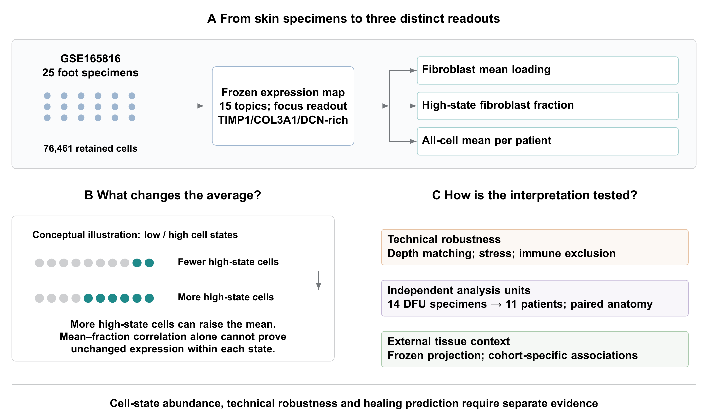

# Wound single-cell measurement construct validation

Published software archive: [10.5281/zenodo.22872448](https://doi.org/10.5281/zenodo.22872448) (version 0.1.0).

Author: Zeyu Fu. Software version: 0.1.0.

Software for testing whether a fibroblast-associated expression loading reflects cell-state abundance and supports patient-level healing inference in public wound single-cell data. The study includes technical controls, patient resampling, paired anatomy, representation comparisons and external tissue-context projections. It does not establish a clinically validated prognostic tool.

The discovery analysis contains 25 specimens mapped to 20 patients. Healing inference uses 14 specimens from 11 patients (7 healed and 4 not healed). Bootstrap draws and cells are not additional independent patients.

This study has its own [GitHub repository](https://github.com/PeterPonyu/wound-measurement-construct), version history, citation metadata and Zenodo deposit metadata. It does not import code or results from another study repository. Its GitHub release and Zenodo deposition are managed independently; no GitHub–Zenodo integration is required.

Read the [manuscript](output/pdf/measurement_construct_validation.pdf) and the [figure collection](manuscripts/figures/figures.pdf). The package contains 8 editable R/TikZ vector figures, numerical tables, completed reports, and its own copy of the frozen expression model. RESULTS_INDEX.json maps numerical reports to manuscript use. A copy of the model is included here so the project runs independently.



## Rebuild from saved numerical inputs

```sh
python3 verify_archive.py --smoke
python3 manuscripts/latex/export_tables.py
python3 manuscripts/build_main_figures.py
python3 manuscripts/latex/build.py --render
python3 scripts/assess_robustness.py --output-dir outputs/reruns/robustness
```

The figure and PDF commands require R with ggplot2, tikzDevice, jsonlite and digest; XeLaTeX/BibTeX/latexmk; Poppler; and installed Arial and TeX Gyre fonts. Fonts are not redistributed. Python package versions are recorded in requirements.txt and environment.json. CPU execution is supported; recorded neural fits used CUDA. The robustness command recomputes the patient bootstrap and omission diagnostics from the saved inputs, without raw-count downloads.

## Rights

The MIT License applies to software, including analysis and rendering programs. Manuscripts, figures, tables, saved models, numerical results and source-study data retain their respective rights as set out in NOTICE. The full reproduction ZIP and the software-only Zenodo ZIP are different artifacts with separate manifests and checksums.

## Citation and independent archiving

Use CITATION.cff for software attribution. ARCHIVING.md describes direct Zenodo deposition using this study's .zenodo.json and software-only ZIP. A reserved identifier is not a published DOI; only verified published records are added to citations. Each study has its own deposit state, preventing accidental reuse of the other study's record.
